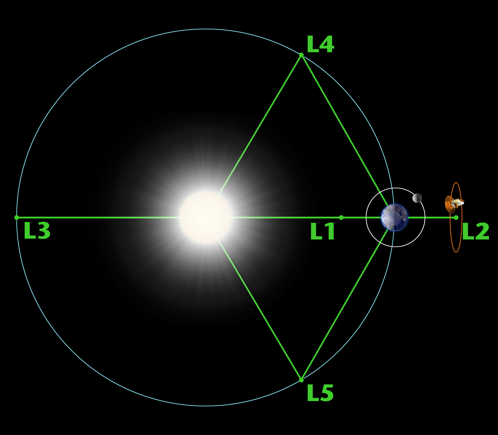

# Restricted 3-body Problem

## Foreword

This document is best viewed in the PDF format so the math renders correctly.
The PDF version can be viewed [here](figs/readme.pdf) in the figs directory.

## Introduction

The n-body simulation problem is a well known problem in both the physics and
high performance computing fields. In this problem, many physical bodies are
given some set of initial conditions and acted upon based off an agreed set of
rules. In this implementation of the n-body problem, 3 masses are created and
acted upon by the law of gravity, and the future state of each mass is
determined by its equations of motion.

## Motivation

The n-body problem with 3 or more masses has no general closed form solution. As
such, in order to simulate and compute these systems, numerical methods must be
used [1]. This project explores a highly constrained version of the n-body
problem, known as the restricted 3-body problem. In the restricted 3-body
problem, 3 masses $m_1$, $m_2$, and $m_3$ are present, but $m_1 << m_2$ and
$m_1 << m_3$. This version has many real world corollaries in astronomy, such as
a satellite orbiting between two massive bodies like the Earth and Moon.

One advantage of the restricted 3-body problem is that the satellite mass is
much smaller than the two other bodies in the system, and therefore it exerts a
nearly negligible force on them. As such, the problem can be treated similarly
to a two body problem (with a general closed form solution) where the two bodies
do interact with each other, and the third body orbits around their center of
mass. However, this project seeks to remove those assumptions and explore
simulations where all three bodies interact with each other to see the resulting
dynamics and if they behave accordingly to the removed assumptions.

## Implementation

Classical mechanics state that the force of gravity is proportional to the
product of two bodies' masses over the square of the distance between them. The
exact equation is shown:

$$F_g = G \frac{m_1 m_2}{r^2}$$

Using numerical integration, the acceleration due to this force can be
calculated, and the subsequent equations of motion can be expressed and their
results calculated. This n-body program uses the 4th order Runge-Kutta (RK4)
method of numerical integration [2]. Given an initial value problem established
by the following:

$$\ddot{x} = f(t, x)$$

$$x(t_0) = x_0$$

The next state of $x$ can be calculated using

$$x_{n+1} = x_n + \frac{1}{6} h (k_1 + 2k_2 + 2k_3 + k_4)$$

where $h$ is the time step, and $k_1$, $k_2$, $k_3$, and $k_4$ are defined as
follows:

$$k_1 = f(t_n, x_n)$$

$$k_2 = f(t_n + \frac{h}{2}, x_n + h \frac{k_1}{2})$$

$$k_3 = f(t_n + \frac{h}{2}, x_n + h \frac{k_2}{2})$$

$$k_4 = f(t_n + h, x_n + h k_3)$$

This RK4 computation is performed for each time step of the simulation, and in
conjunction with the law of gravity, the next state of the body can be derived
from the computed acceleration. Velocity is calculated according to
$\dot{x} = \ddot{x}t$ and the position from $x = \dot{x}t$.

These RK4 computations are handled in the `integration.cpp` file as part of the
`RK4` class. For each step of RK4, an approximation of the next state is made,
and then the results are combined to create a more accurate final approximation.
The code snippet below comes from `RK4::single_body_accel` and shows how one
step of the acceleration of is calculated.

```cpp
double grav = G * other->mass / (r * r * r);

k1 = (other->position - target_body.position) * grav;

vel_update = partial_step(target_body.velocity, k1, 0.5);
pos_update = partial_step(target_body.position, vel_update, 0.5);
k2 = (other->position - pos_update) * grav;

vel_update = partial_step(target_body.velocity, k2, 0.5);
pos_update = partial_step(target_body.position, vel_update, 0.5);
k3 = (other->position - pos_update) * grav;

vel_update = partial_step(target_body.velocity, k3, 1);
pos_update = partial_step(target_body.position, vel_update, 1);
k4 = (other->position - pos_update) * grav;

accel += (k1 + k2 * 2 + k3 * 2 + k4) / 6;
```

The above computations are performed on each body for every time step of the
simulation. Afterwards, the results are then propagated and used to update
the velocity and the position of each body in `RK4::update_velocity` and
`RK4::update_position` respectively..

## Demonstration

To first demonstrate that the laws governing the simulation are implemented
correctly, a confirmation can be performed using systems that have known
solutions. An example of one such system would be the Earth-Moon system. Because
this problem only involves two bodies, not only can the expected results be
computed analytically, the resulting dynamics should closely model that of the
real world. Using the Python library Matplotlib, we can look at the simulated
dynamics of this system.


As expected the moon orbits in a circular path around the Earth. While this
acts as a demonstration of the physical stability of the simulation, there is
still room for numerical instability. Numerical instability would result in
bodies drifting apart or experiencing other abnormal behavior even when the
physics state that the system should be stable.

Unfortunately it is harder to definitively demonstrate that no numerical
instability exists, and in reality there will likely always be some numerical
instability due to how computers store floating point numbers. However, one
scenario that would absolutely lead to instability is when there are two masses
passing very close to each other. In this program all of the bodies exist at a
single point, and no collisions are simulated. Because of this, two bodies could
pass through the same space or have a distance between them that is nearly zero.
This would result in very large forces between them which would then be
propagated to the next time step in the simulation. In a perfect world this
would not cause issues, but due to the nature of the simulation, and the fact
that time passes in a discrete manor, some issues can arise that seemingly
violate physical and mathematical laws if not careful.

However in the experimental setup that is primarily discussed in this project,
these such scenarios are not a factor, and for the most part the numerical
stability of the program can be trusted. This can be confirmed by plotting the
center of mass of a stable system (where the total momentum is zero). Two
examples of this are shown below. In the first example, four bodies of equal
mass are placed equidistant from the origin. Each body is given the same initial
speed in the direction that would make it move clockwise with respect to the
origin (when looking down from +z). The second figure shows three bodies of
equal mass placed to form a scalene triangle. The initial velocities of each
mass is zero in this configuration. Both of these scenarios are examples of
stable ones in which the masses are expected to orbit a stationary center of
mass, and this is shown to be the case.


## Results

As stated before, this project seeks to primarily explore the restricted 3-body
problem. In the experimental setup three bodies are added to the system, Earth
with $m_e = 5.97 * 10^{24}$ kg, Moon with $m_m = 7.34*10^{22}$ kg, and a
satellite with $m_s = 1000$ kg. The Earth is placed at the origin with zero
initial velocity. The moon is placed $3.844*10^8$ meters away on the x axis
and is given an initial velocity of $v_y = 1020$ m/s. The satellite is placed at
the L4 Lagrange point (discussed below) and given an initial speed equal to the
Moon's, but in the direction of its orbit.

The expectations of this setup would that the Earth and Moon form a stable
orbit, and due to the much smaller mass of the satellite, it is able to be added
to the stable system non-disruptively. To demonstrate this, a special case of
orbit is used known as a Lissajous orbit.

Lissajous orbits are a class of orbits that exist primarily at the L4 and L5
Lagrange points. These points are considered stable areas where the forces
between the Earth and Moon balance out. These points exist for all pairs of
massive bodies that orbit each other as long as the ratio of their masses
roughly exceeds 25 [5]. An example of the Lagrange points between the Sun and
Earth is shown below.



Using the priorly discussed initial conditions and running the simulation
for 28 days, the following orbits are produced.


Two things may be immediately apparent: the center of mass moves, and the
satellite orbit begins to drift outwards. In regards to the center of mass
moving, this relates to the total momentum of the system. Because the earth is
not given an initial velocity, the total momentum of the system is non-zero.
This leads to the Earth "falling" towards the center of mass of the system, and
the results is that the entire system begins to slowly drift. This can be solved
by giving the Earth a small initial velocity and results in the following
figure.


This small change fixes both the center of mass drift and the outwards
drift of the satellite. There is still some small drift of the satellite, but
this is likely due to numerical errors and slight approximations of values.

## Discussion

Based off of the findings above, this project can largely be considered a
success. Not only was the restricted 3-body problem successfully simulated, but
the results were mostly confirmed through an analysis of the governing physical
laws. Additionally, simulation of the L4 Lissajous orbit shows the advanced
capabilities of numerical simulations such as this one by producing a stable
3-body orbit without chaos. Further work on this project may seek to reduce
sources of numerical error and make improvements to the computational methods
such that even greater accuracy can be achieved. Additionally, simulations using
more bodies may be good topics of exploration.

## Code

Code for this project can be found at
[https://github.iu.edu/evogelsa/n-body-simulation](https://github.iu.edu/evogelsa/n-body-simulation)

## References

```txt
Background of the n-body problem:
[1] https://en.wikipedia.org/wiki/N-body_problem

Runge-Kutta numerical method and math:
[2] https://en.wikipedia.org/wiki/Runge%E2%80%93Kutta_methods

Lagrange points background:
[3] http://hyperphysics.phy-astr.gsu.edu/hbase/Mechanics/lagpt.html#c1

Lagrange point calculations of Earth-Moon system:
[4] https://www.researchgate.net/figure/Locations-of-the-five-Earth-Moon-Lagrangian-points-namely-where-the-Earth-and-Moon_fig1_228781180

Lagrange point background and image:
[5] https://solarsystem.nasa.gov/resources/754/what-is-a-lagrange-point/

Computation and physical constants:
[6] https://www.wolframalpha.com/
```
